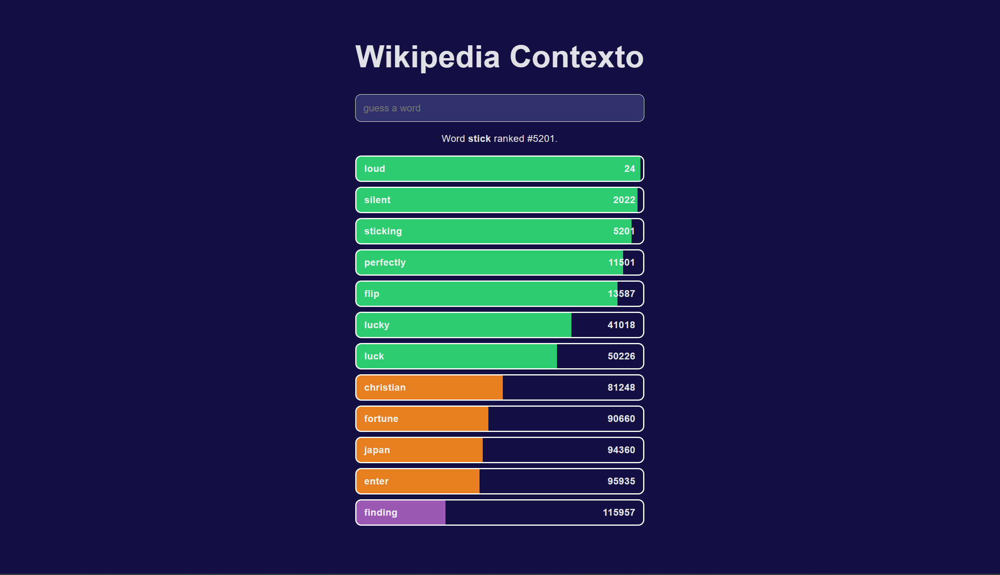

# Wikipedia Contexto
An even worse clone of contexto with no end screen (because there's no way you'll get to the end with how scuffed the word list is). Here is a demo of how the game looks with the target word `quiet`.

The fact the antonym `loud` ranks significantly higher than the synonym `silent` goes to show how flawed the comparison between words currently is. We're using cosine similarity to evaluate the similarity as shown in the following function:
```python
def cosine_similarity_matrix(guess_vec, all_vecs):
    guess_norm = np.linalg.norm(guess_vec)
    all_norms = np.linalg.norm(all_vecs, axis=1)
    dot_products = all_vecs @ guess_vec
    return dot_products / (all_norms * guess_norm)
```
Where `guess_vec` is the vector of the target word from [glove.6B.100d.txt](https://www.kaggle.com/datasets/danielwillgeorge/glove6b100dtxt) and `all_vecs` is a list of all valid words in the glove. These lists of words and gloves can be created as `txt` and `pkl` files using `notebooks/graph.ipynb`.

## Other Notes

Currently, the target word is printed in the backend logs when the `start_game` endpoint is called.

## TODO
- Create a hint option to reveal a word that's close to the target word
- Verify the word lists used (because a lot of words are designated too common and too uncommon)
- Verify the word lemma crosscheck. Some words' lemma aren't being picked up, or are incorrectly outputted (that is, the original word is outputted instead of the lemma).
- Use other word lists. Get a list of most common wikipedia webpages and weight words' relationships based on how frequently they appear in the same webpage.
- Make an option to be able to choose the word list from a dropdown. Store these word lists as a `glove.pkl` file and a `words.txt` file in a unique directory with the name of the word list in `backend/data`.
